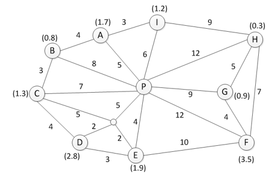

## Introduction

This is a Vehicle Routing Problem solver compatible with a range of VRP variants. We introduced a new form of Hybrid Genetic Algorithm and it was finetuned to fit CVRP in this repo, and performs well on [Capacitated VRP Instances](http://neo.lcc.uma.es/vrp/vrp-instances/capacitated-vrp-instances/). Below are some tricks we employed in the algorithm.

* We introduced an innovative genetic coding method, which is compatible with a range of VRP variants.
* We employed Variable Neighborhood Search after every generation of Genetic Algorithm to accelerate the convergence rate.
* There are 4 populations which evolve concurrently, and they swap a proportion of good genes every few generations.

## Hybrid Genetic Algorithm


### Genetic Coding


The chromosome is a loop consisting of both vehicle and customer genes, shown above, where $V_i$ represents a vehicle of type $i$ and $C_j$ a customer with ID $j$.  

Thus, the route in this chromosome decodes as:

```
Route1(with Vehicle Type-1): depot -> customer1 -> customer2 -> customer3 -> depot
Route2(with Vehicle Type-1): depot -> customer4 -> customer5 -> depot
Route3(with Vehicle Type-2): depot -> customer6 -> customer7 -> depot
```

### Loss Metrics

We defined the loss function as:

$loss=distancePrior \cdot total\_distance+timePrior \cdot total\_time+loadPrior \cdot average\_load\_factor$

and our goal is to minimize the loss function.

As the scale of distance, time and load factor is different, some tricks are applied to normalize them.

We use std::pair<double, double> to denote the loss of a chromosome, where the first number is penalty for violate the constaints and the second the value of loss function.

### Initialization


All four populations are initialized randomly, except for a Clark-Wright Saving constructed super individual pushed into population 0. Each population takes up a geographical position, as illustrated above, according to which migration will take place.

### Crossover


Offsprings are reproduced with the crossover operator. Specification is commented below.

1. Randomly choose 2 individuals, written P1(left-hand side) and P2(right-hand side).
2. For P1, a gene fragment is sliced randomly, written S1. And we obtain S2 by removing all the customers appearing in S1 from P2. 
3. Concatenate the two fragments S1 and S2. 
4. Remove useless vehicles which have no customer to serve.

### Mutation

We designed two kinds of mutation operators, which are customer-base and vehicle-based. Illustrations are better than explanation.

#### Customer-Based Mutation

* Swap

  

* Shift

  

* Reverse

  


#### Vehicle-Based Mutation

* Change

  

* Insert

  

* Remove


### Selection

We select the top **ELITE_RATE**% individuals with lowest $loss$ directly to the next generation. And for the remains, simulated-annealing like method is applied, which is to keep the good individual and to accept relatively bad individual with a proper probability.

### Finetune

We randomly perform **swap**, **shift**, **reverse** and **remove** many times to search the neighbor of a chromosome with the probability of **FINETUNE_RATE** for it is a heavily time-consuming operation. It drastically enhanced the performance of the algorithm.

### Migration


Migration is applied every **MIGRATION_STEP** generations. The migration between Populaiton 0 and 1, 2 and 3 is bidirectional, whereas between Population 0 and 2, 1 and 3 is one-way. Such direction constraint ensures that the super individual constructed by CWS in Population 0 will not contaminate the whole species.

## Experiment

### Interface

We use STDIO for input and output. However, a simpler interface is also provided in **test.js**.

Input format is shown below.

```
<num_of_customer>
<node_id> <demand> <service_time> <tw_beg> <tw_end>
...
<num_of_depot>
<node_id>
...
<num_of_other>
<node_id>
...
<num_of_edge>
<point1> <point2> <distance>
...
<num_of_vehicle>
<speed> <work_time>
<vehicle_type_id> <depot> <capacity> <mileage> <count>
...
<distancePrior> <timePrior> <loadPrior>
<max_iter>
```

| Keyword         | Comments                                        |
| --------------- | ----------------------------------------------- |
| num_of_customer | the number of customers                         |
| num_of_depot    | the number of depots                            |
| num_of_other    | the number of irrelevant nodes                  |
| node_id         | node ID                                         |
| demand          | demand                                          |
| service_time    | the time for unloading goods (hour)             |
| tw_beg          | the beginning of time window, -1 for don't care |
| tw_end          | the ending of time window, -1 for don't care    |
| num_of_edge     | the number of undirected edges                  |
| point1 point2   | two nodes that connected by the edge            |
| distance        | the length of the edge                          |
| num_of_vehicle  | the number of vehicles                          |
| speed           | the speed of all vehicles                       |
| work_time       | the maximum work time of all vehicles           |
| vehicle_type_id | vehicle type ID                                 |
| depot           | the depot that the vehicle is to and from       |
| capacity        | how many goods this type of vehicle can carry   |
| mileage         | how long the vehicle can travel                 |
| count           | how many vehicles can be used, -1 for unlimited |
| distancePrior   | the weight of distance                          |
| timePrior       | the weight of time                              |
| loadPrior       | the weight of load factor                       |
| max_iter        | the number of steps should be run               |

For example, if you want to solve a problem described as:

1. A undirected graph shown below, where P is the depot and A-I are customers, and a untitled irrelevant node. Numbers shown in bracket denote the demand. Numbers on the edge are edge length. The service time of all customers is 5min.

   

2. You have two types of unlimited vehicles with capacity 2 and 5. All vehicles travel with speed 10 and work 8 hours a day.

3. You want to minimize the distance with 200 iterations.

The input should be

```
9
1 1.7 0.083 -1 -1
2 0.8 0.083 -1 -1
3 1.3 0.083 -1 -1
4 2.8 0.083 -1 -1
5 1.9 0.083 -1 -1
6 3.5 0.083 -1 -1
7 0.9 0.083 -1 -1
8 0.3 0.083 -1 -1
9 1.2 0.083 -1 -1
1
0
1
10
22
0 1 5
0 2 8
0 3 7
0 10 5
0 5 4
0 6 12
0 7 9
0 8 12
0 9 6
1 2 4
1 9 3
2 3 3
3 4 4
3 10 5
4 5 3
4 10 2
5 6 10
5 10 2
6 7 4
6 8 7
7 8 5
8 9 9
2
10 8
1 0 2 35 -1
2 0 5 35 -1
1 0 0
200
```

And you have a decent chance to get the optimum solution in JSON format.

```json
{
  "plan": [
    {
      "vid": 2, // vehicle type ID
      "trips": [ // a vehicle can run multiple trips
        {
          "serve": [4, 5], // the customers should be served
          "route": [0, 5, 4, 5, 0], // the route
          "distance": 14, // distance of this trip
          "time": 1.56667, // time of this trip
          "load": 4.7 // total demand of this trip
        }
      ],
      "distance": 14, // distance of the whole trips
      "time": 1.56667, // time of the whole trips (hour)
      "loadFactor": 0.94 // load factor of the whole trips
    },
    {
      "vid": 2,
      "trips": [
        {
          "serve": [8, 6, 7],
          "route": [0, 8, 6, 7, 0],
          "distance": 32,
          "time": 3.45,
          "load": 4.7
        }
      ],
      "distance": 32,
      "time": 3.45,
      "loadFactor": 0.94
    },
    {
      "vid": 2,
      "trips": [
        {
          "serve": [3, 2, 1, 9],
          "route": [0, 3, 2, 1, 9, 0],
          "distance": 23,
          "time": 2.63333,
          "load": 5
        }
      ],
      "distance": 23,
      "time": 2.63333,
      "loadFactor": 1
    }
  ],
  "distance": 69, // distance of the whole plan
  "time": 3.45, // time of the whole plan
  "loadFactor": 0.96 // load factor of the whole plan
}
```

### Hyperparameter

All hyperparameters are defined in **problem.h**.

```c++
// population size
static constexpr int POPSIZE = 100;

// with what proportion that good individuals
// are chosen directly to the next generation
static constexpr double ELITE_RATE = 0.5;

// the probability that crossover will happen
static constexpr double CROSSOVER_RATE = 0.6;

// the probability that mutation will happen
static constexpr double MUTATION_RATE = 0.05;

// the probability that finetune will happen
static constexpr double FINETUNE_RATE = 0.1;

// with what proportion that good individuals
// are exchanged between populations
static constexpr double MIGRATION_RATE = 0.2;

// migration will occur every how many steps
static constexpr int MIGRATION_STEP = 15;
```
### Benchmark

We tested our algorithm on  [Capacitated VRP Instances](http://neo.lcc.uma.es/vrp/vrp-instances/capacitated-vrp-instances/). We set **distancePrior**=1, **timePrior**=0, **loadPrior**=0 in order to minimize the distance. Below are the result with 200 generations.

The test code can be found in **test.js**.

| **Dataset** | **Benchmark / km** | **Distance / km** | **Error** | **Time / s** |
| ----------- | ------------------ | ----------------- | --------- | ------------ |
| P-n16-k8    | 450                | 451.34            | 0.2%      | 0.210        |
| A-n33-k5    | 661                | 697.16            | 5.5%      | 0.333        |
| A-n45-k6    | 944                | 986.90            | 4.5%      | 0.456        |
| A-n60-k9    | 1408               | 1410.70           | 0.2%      | 0.637        |
| A-n80-k10   | 1764               | 1869.12           | 6.0%      | 0.761        |
| E-n101-k14  | 1071               | 1133.16           | 5.8%      | 1.035        |
| M-n200-k17  | 1373               | 1402.27           | 2.1%      | 1.911        |

And the result with 2000 generations.

| **Dataset** | **Benchmark / km** | **Distance / km** | **Error** | **Time / s** |
| ----------- | ------------------ | ----------------- | --------- | ------------ |
| P-n16-k8    | 450                | 451.34            | 0.2%      | 3.519        |
| A-n33-k5    | 661                | 622.26            | 0.2%      | 3.868        |
| A-n45-k6    | 944                | 956.78            | 1.4%      | 4.651        |
| A-n60-k9    | 1408               | 1407.09           | -0.1%     | 6.543        |
| A-n80-k10   | 1764               | 1849.58           | 4.9%      | 8.376        |
| E-n101-k14  | 1071               | 1126.62           | 5.2%      | 10.591       |
| M-n200-k17  | 1373               | 1385.29           | 0.9%      | 21.280       |

## References

[1]Lu Zhen,Chengle Ma,Kai Wang,Liyang Xiao,Wei Zhang. Multi-depot multi-trip vehicle routing problem with time windows and release dates[J]. Transportation Research Part E,2020,135.

[2]Diego Cattaruzza,Nabil Absi,Dominique Feillet. The Multi-Trip Vehicle Routing Problem with Time Windows and Release Dates[J]. Transportation Science,2016.

[3]X. Wang, C. Xu and H. Shang, "Multi-Depot Vehicle Routing Problem with Time Windows and Multi-Type Vehicle Number Limits and its Genetic Algorithm," 2008 4th International Conference on Wireless Communications, Networking and Mobile Computing, Dalian, 2008, pp. 1-5.

[4]Mahdi Alinaghian,Nadia Shokouhi. Multi-depot multi-compartment vehicle routing problem, solved by a hybrid adaptive large neighborhood search[J]. Omega,2018,76.

[5]Clarke, G., Wright, J.W., 1964. Scheduling of vehicles from a central depot to a number of delivery points. Operations Research 12 (4), 568–581.